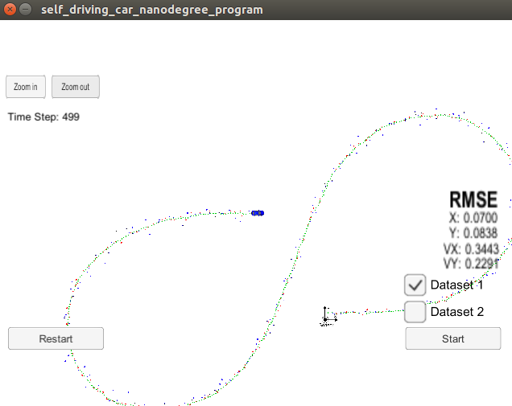

# Unscented Kalman Filter Project
Self-Driving Car Engineer Nanodegree Program

In this project an unscented kalman filter is implemented in C++ to estimate the state of a moving object of interest with noisy lidar and radar measurements. Passing the project requires obtaining RMSE values that are lower that the tolerance outlined in the project rubric [.09, .10, 0.40, 0.30]. These are stricter requirements than the extended Kalman filter.

In my implementation, I used a process noise standard deviation of 2 m/s^2 and 1 rad/s^2 for longitudinal and yaw acceleration, respectively. This achieved good results with the data set, and good normalized innovation squared (NIS) values.

The result of the UKF at the end of running through dataset1 is shown below

